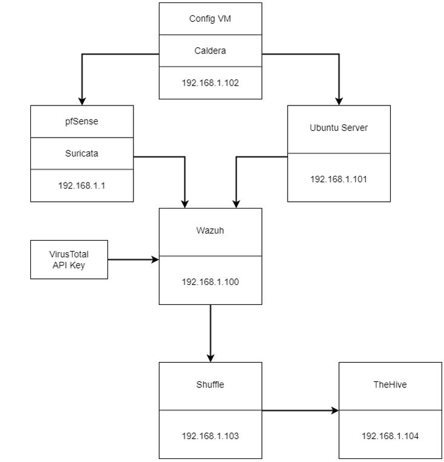

# Security Operations Center

In this project, I developed a comprehensive Security Operations Center (SOC) as part of my coursework in Cybersecurity. The SOC was designed to detect, analyze, and respond to a wide range of security incidents, providing a proactive defense for an internal network. The project combined several open-source tools to build an integrated system capable of real-time monitoring and automated incident response, simulating real-world security operations scenarios.

**Report:** [SOC Documentation](soc_documentatie.pdf)

**Video:** [YouTube](https://youtu.be/N6xHx_H27Vk)

**Completed:** January 2023

## Security Operations Center

### Overview of the SOC Architecture
The SOC was deployed in a virtual environment using Ubuntu Server 22.04 as the core operating system. I chose Ubuntu due to its flexibility, security, and familiarity with Linux-based security tools. The production system was secured by pfSense, a powerful firewall and router solution, which managed all network traffic. pfSense ensured that the internal network was shielded from external threats by segmenting traffic and acting as the first line of defense.

### Threat Detection and Prevention

### Centralized Log Management and SIEM: Wazuh

### Malware Detection and Automated Response with VirusTotal

### Automation and Incident Response: Shuffle IO

### Incident Management and Collaboration: TheHive

### Project Outcomes and Key Learnings

